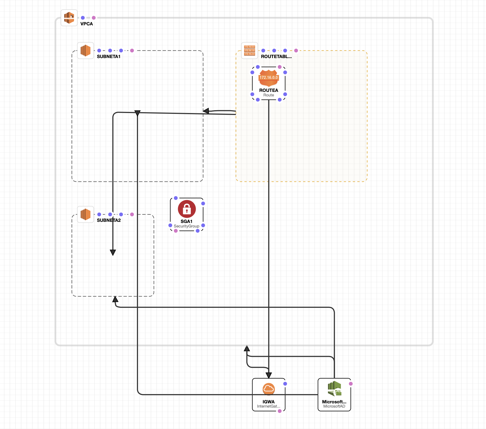

# Cloud Formation Template

This repo contains the JSON template to create a Managed Microsoft AD in AWS . It follows the architecture given below and has the following salient features:

* During the creation of the stack, a VPC with 2 Subnets are created (Prerequisites for the Managed AD
* The cloud formation templates can be loaded onto the **Cloudformation Designer in AWS** and it would appear as below:

  

* To spin the cluster up, log in to AWS, choose 'US-EAST-1 as your region, then go to cloudformation, choose designer, and copy and paste the contents of either the JSON or YAML file into the designer code window, click update designer, validate the template, and spin up the template.